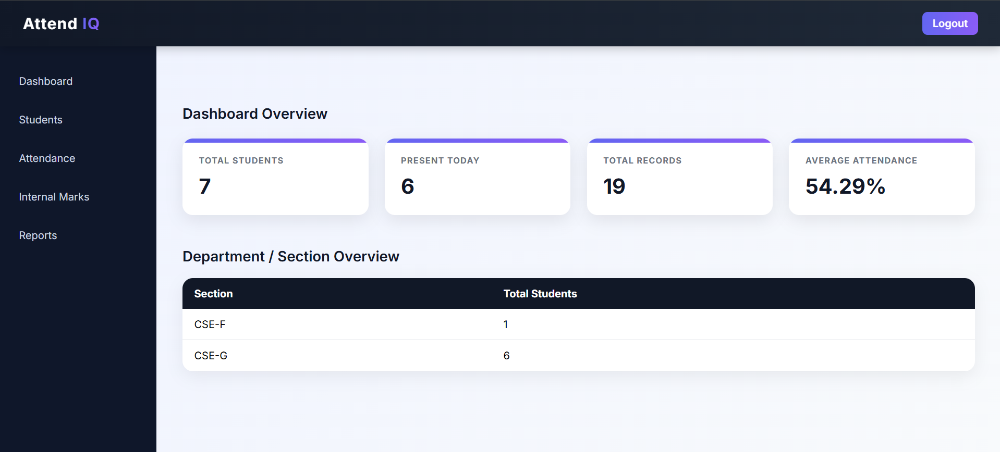
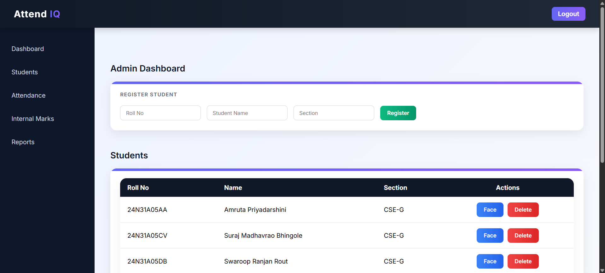
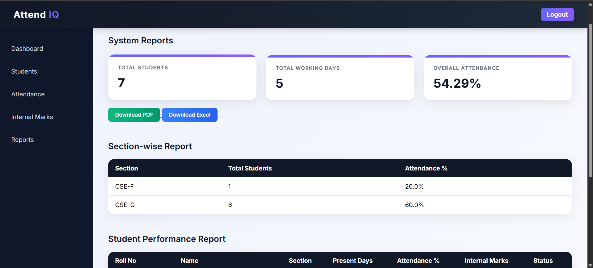

# 🎓 AttendIQ – Smart Attendance System

AttendIQ is a Face Recognition based Smart Attendance Management System built using Flask, OpenCV, and SQLite.  
It automates student attendance tracking and internal marks calculation based on attendance percentage.

---

## 🚀 Features

- 🔐 Admin Login System
- 👨‍🎓 Student Registration
- 📷 Face Registration (Camera Capture)
- 🧠 Face Recognition Based Attendance
- 📊 Automatic Attendance Percentage Calculation
- 📝 Internal Marks Calculation (80 Marks based on 15 Days Rule)
- 📈 Section-wise and Student-wise Reports
- 📥 Export Reports to PDF
- 📊 Export Reports to Excel
- 🎨 Premium Admin Dashboard UI

---

## 🛠 Tech Stack

- **Backend:** Flask (Python)
- **Database:** SQLite
- **Face Recognition:** OpenCV
- **PDF Generation:** ReportLab
- **Excel Export:** OpenPyXL
- **Frontend:** HTML, CSS (Custom Dashboard UI)

---

## 📸 Screenshots

### 🏠 Dashboard Overview

### 👨‍🎓 Admin Dashboard

### 📊 Reports Page

---

## 📂 Project Structure

Smart Attendance System/
│
├── app/
│ ├── services/
│ ├── static/
│ ├── templates/
│ └── utils/
│
├── data/
│ ├── registered_faces/
│ └── attendance_logs/
│
├── docs/
│ └── screenshots/
│
├── app.py
├── setup_db.py
├── requirements.txt
└── README.md

---

## ⚙️ Installation & Setup

### 1️⃣ Clone the repository

git clone https://github.com/YOUR_USERNAME/Smart-Attendance-System.git

cd Smart-Attendance-System

### 2️⃣ Create Virtual Environment
python -m venv venv

Activate:

**Windows**
venv\Scripts\activate

**Mac/Linux**
source venv/bin/activate

### 3️⃣ Install Dependencies
pip install -r requirements.txt

### 4️⃣ Setup Database
python setup_db.py

### 5️⃣ Run Application
python app.py

## 🔐 Default Admin Credentials
Username: admin
Password: admin123

---

## 📊 Internal Marks Logic

- 15 Attendance Days = Full Marks
- Total Internal Marks = 80
- Formula:
Marks = (Present Days / 15) × 80
(Max capped at 80)

---

## ⚠️ Important Notes

- Camera access is required for face registration and attendance.
- This project is intended for local deployment (webcam-based).
- Cloud deployment is not supported due to hardware dependency.

---

## 📈 Future Improvements

- Multiple Admin Roles
- Email Notifications for Low Attendance
- Cloud Storage Support
- Live Attendance Graphs
- Password Hashing for Security

---

## 👨‍💻 Author

Developed as part of an academic project.

---

## 📜 License

This project is for educational purposes.

